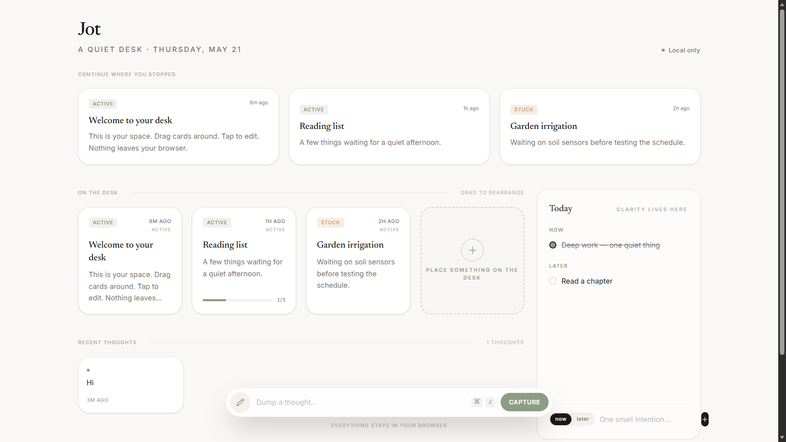

# Jot: A Quiet Desk for Your Mind

> Continue where you stopped.

Jot is a calm, local-first personal workspace. It’s not about "doing more", it's about feeling less scattered. It’s a thinking space designed to reduce cognitive load and provide emotional clarity.



---

## 🌿 The Philosophy

Most productivity tools shout. Jot whispers.

Modern software often exhausts us with dashboards, notifications, and complex hierarchies. Jot is built to feel like a **physical desk**:
- **Calmness**: Muted palettes, soft shadows, and generous spacing.
- **Intentionality**: Focus on what matters *now* and what you need to *continue* later.
- **Low Friction**: No accounts, no onboarding, no cloud. Just open and think.
- **Trust**: Everything stays in your browser. Your thoughts are yours.

---

## ✨ Features

- **Activity Cards**: Tactile, movable cards for projects, tasks, or ideas.
- **Brain Dump**: A non-invasive capture bar for instant thoughts that live right on your desk.
- **Focus Panel**: A "sacred" space for today’s clarity—Now and Later.
- **Momentum Tracking**: Subtle visual cues highlight where you left off and which ideas have gone quiet.
- **Local-First**: Built with Dexie (IndexedDB) for instant speed and total privacy.

---

## 🛠 Tech Stack

Jot is built with a modern, high-performance stack:

- **Framework**: [TanStack Start](https://tanstack.com/start) (React 19)
- **Routing**: [TanStack Router](https://tanstack.com/router)
- **Styling**: [Tailwind CSS 4](https://tailwindcss.com/) & [Framer Motion](https://www.framer.com/motion/)
- **Database**: [Dexie.js](https://dexie.org/) (IndexedDB)
- **Icons**: [Lucide React](https://lucide.dev/)
- **Drag & Drop**: [@dnd-kit](https://dnd-kit.com/)

---

## 🚀 Getting Started

### Prerequisites
- [Bun](https://bun.sh/) (recommended) or Node.js

### Setup
1. Clone the repository
2. Install dependencies:
   ```bash
   cd apps/dashboard
   pnpm install
   ```
3. Start the development server:
   ```bash
   pnpm dev
   ```
4. Open [http://localhost:8000](http://localhost:8000)

---

## 🤝 Contributing

We love contributors who care about **mental health, cognitive support, and calm design.**

If you're an engineer who believes software should feel like a quiet environment, we'd love your help:
- **Refine the "Feeling"**: Help us make interactions softer and more tactile.
- **Cognitive Support**: Propose features that help users feel less overwhelmed.
- **Performance**: Keep the "local-first" experience instant and light.

Check out our [CHANGELOG.md](./CHANGELOG.md) to see where we've been and where we're going.

---

## 📜 License
MIT
